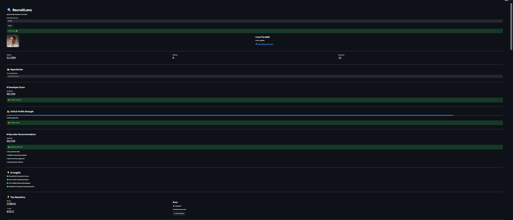
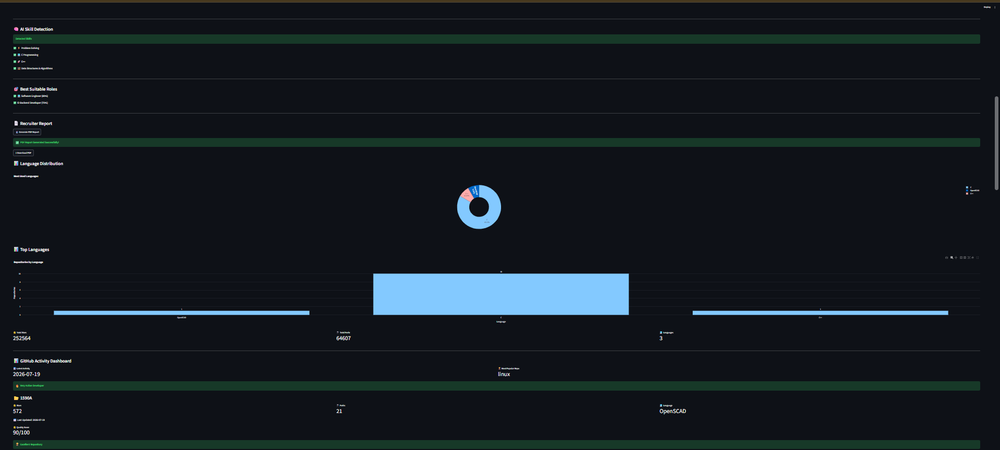

# 🔍 RecruitLens

### AI-Powered GitHub Developer Analytics Platform


RecruitLens is an AI-powered web application that analyzes GitHub profiles and provides developer insights, skill detection, recruiter recommendations, repository quality analysis, and downloadable recruiter reports.

---

## 🚀 Live Demo

## 📸 Dashboard Preview

### Dashboard - Overview



---

### Repository Analysis & Charts



---

---

## ✨ Features

- 🤖 AI Developer Score
- 💪 GitHub Profile Strength Analysis
- 📊 GitHub Activity Dashboard
- 🧠 AI Skill Detection
- 🎯 Best Suitable Roles
- 🏆 Repository Quality Score
- 🤖 AI Repository Summary
- 📈 Language Distribution Charts
- 📄 PDF Recruiter Report
- 🔍 Repository Search
- ⚡ Real-time GitHub Profile Analysis

---

## 🛠 Tech Stack

- Python
- Streamlit
- GitHub REST API
- Plotly
- Pandas
- ReportLab


## ⚙️ Installation

Clone the repository:

```bash
git clone https://github.com/Harshpandey1-prog/RecruitLens.git
```

Navigate to the project:

```bash
cd RecruitLens
```

Install dependencies:

```bash
pip install -r requirements.txt
```

Run the application:

```bash
streamlit run app.py
```
## 📂 Project Structure

```text
RecruitLens/
│── assets/
│   ├── dashboard1.png
│   └── dashboard2.png
│
│── components/
│   ├── charts.py
│   ├── insights.py
│   ├── roles.py
│   ├── score.py
│   └── skills.py
│
│── github_api/
│   ├── fetch_repos.py
│   └── fetch_user.py
│
│── app.py
│── requirements.txt
│── README.md
```
## 🔮 Future Enhancements

- 🤖 AI Resume Matching
- 📊 GitHub Contribution Heatmap
- 👥 Compare Two GitHub Profiles
- 📈 Personalized Developer Growth Roadmap
- 📄 ATS-Friendly Resume Analysis
- ☁️ Database Integration
- 🔐 User Authentication
- 📱 Mobile Responsive Design

## 👨‍💻 Author

**Harsh Raj**

🎓 B.Tech CSE (Data Science)  
🏫 Galgotias University

- GitHub: https://github.com/Harshpandey1-prog
- Project: RecruitLens – AI-Powered GitHub Developer Analytics Platform

⭐ If you found this project useful, consider giving it a star!

---

## 📄 License

This project is licensed under the **MIT License**.

Feel free to use, modify, and distribute this project for educational and personal purposes.